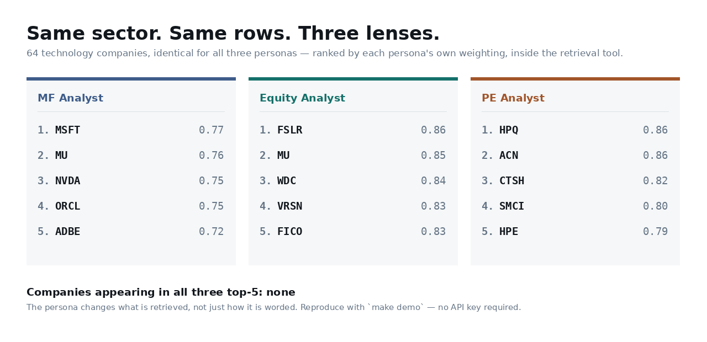

# Sector Lens

[](https://github.com/captflag/sector-lens/actions/workflows/ci.yml)
[](https://www.python.org/)
[](LICENSE)

**A persona-configurable analyst agent that cannot make things up about data it
does not have.**

Three financial analyst personas share one agent, one database and one set of
tools. Ask them the same question about the same sector and they return
different companies — because the persona's weighting is applied inside the
retrieval tool, below the language model, rather than in a prompt telling it to
sound different.

<picture>
  <source media="(prefers-color-scheme: dark)" srcset="docs/img/personas-dark.png">
  
</picture>

Reproduce with `make demo`. **No API key required** — the divergence happens in
the tool, not the model.

*Your run will differ from that figure: the upstream market data refreshes
daily, so a rebuild moves the ordering. The bottom line is the claim; the
tickers are today's instance of it. The figure is regenerated by
`python scripts/make_hero_image.py`, so it cannot drift from what the code
actually produces.*

---

## The problem it addresses

An LLM pointed at a database will answer questions it has no data for. It will
quote a headcount it never retrieved, call a company "cheap" without measuring
anything, and discuss a business that isn't in the dataset at all — fluently,
and with no signal to the reader that anything went wrong.

This treats that as a systems problem rather than a prompting one:

- **Absence is a first-class tool result.** Asking about a company that isn't
  loaded returns `in_database: false` with explicit guidance, not a nearest
  guess. Asking for a headcount nobody stored returns an empty result that says
  so and names what would populate it.
- **Every stored fact carries its source**, and every derived value carries the
  arithmetic that produced it, so the agent can tell a reported figure from an
  inferred one — and says which it is using.
- **Data-quality caveats are database rows**, recomputed on every build, so the
  agent cites them at answer time instead of a README asking you to take a
  paragraph on trust.
- **The tool trace is observed by the harness, not asserted by the model.** A
  model cannot claim it called a tool it did not call.
- **All of it is scored.** `make eval` grades answers on grounding, retrieval
  discipline and persona reasoning, and a grounding failure zeroes the case.

---

## Quickstart

Python 3.11+.

```bash
make install                 # venv + dependencies
cp .env.example .env         # add ANTHROPIC_API_KEY for reasoned answers
make db                      # build the database (~15s, needs GitHub only)
make test                    # 155 tests
make demo                    # persona divergence, no key needed
make eval                    # score answers against the case set

make api                     # REST on :8000  (/docs for OpenAPI)
make ui                      # Streamlit on :8501
```

<details>
<summary><b>Windows (PowerShell)</b></summary>

```powershell
py -3.11 -m venv .venv
.\.venv\Scripts\Activate.ps1
pip install -r requirements.txt
pip install -e .

copy .env.example .env
python -m sectorlens.ingest.build_db --fresh
python -m pytest tests -q
python scripts\demo_personas.py --sector tech
uvicorn sectorlens.api.main:app --port 8000
streamlit run src\sectorlens\ui\streamlit_app.py
```
</details>

**It runs with no credentials.** Without a key the agent falls back to a
deterministic provider that still goes through the same MCP tools and the same
persona weighting, composing the answer from templates instead of writing it
with a model. Retrieval, ranking, evidence, caveats and the tool trace are all
real; only the prose is templated. Every response names which provider produced
it.

---

## Architecture

```
   Streamlit UI ──┐
                  ├──> Agent.ask ──> LLM provider ──> Claude
   REST API ──────┘        │         (or deterministic)
                           │
                           │  MCP — JSON-RPC over stdio
                           ▼
                   MCP server (11 tools)    ← separate process
                           │
                           ▼
                   SQLite, opened read-only
```

> **[Component and sequence diagrams →](docs/architecture.md)** — how a request
> moves through the tool loop, where the persona bites, and what happens when
> the model is unreachable.

Both interfaces call the same `Agent.ask` and serialise the same
`AgentResponse`, so "one agent, two interfaces" is structural rather than a
convention someone has to maintain.

**The agent holds no database handle.** It launches the MCP server as a child
process, discovers the tool surface with `list_tools`, and acts only through
`call_tool`. The claim is checkable rather than asserted:

```console
$ grep -rl sqlite3 src/sectorlens/agent/
(no matches)
```

Swapping SQLite for a warehouse, or moving the server to another host over
streamable HTTP, touches no agent code. The connection is opened with SQLite's
`mode=ro` URI and every statement is parameterised, so no tool argument — even
one a model was talked into producing — can write to it.

I used a **manual agentic loop** rather than an agent framework. The tools are
discovered over MCP at runtime and every round trip is recorded for the audit
trail; a framework would have hidden both behind an abstraction I would then
have had to fight.

### The tools

| Tool | Purpose |
|---|---|
| `list_sectors` | What is in scope at all |
| `list_companies` | The universe being reasoned over |
| `find_company` | **Scope check** — returns `in_database: false` explicitly |
| `get_company_profile` | Everything held on one company, with provenance |
| `get_company_signals` | Headcount/hiring, or an explicit "nothing held" |
| `screen_sector` | **Persona-weighted ranking** — the primary evidence source |
| `get_sector_benchmarks` | Medians and quartiles, to anchor comparative claims |
| `compare_companies` | Side by side, naming any ticker not in the database |
| `get_metric_history` | One metric across every period held, with direction of travel |
| `search_filings` | **What management actually wrote** — passages with ticker, date and section |
| `describe_data_coverage` | Sources, licences, ingest runs, open quality findings |

`sector` and `persona` are enumerated in the tool schema rather than described
in prose, so an invalid value is unrepresentable instead of merely discouraged.

---

## How persona changes retrieval

A persona is a YAML block, not a prompt string. Each carries three things that
bite at different layers:

| Layer | Field | Effect |
|---|---|---|
| Retrieval | `screen_weights` | Which companies come back from the database |
| Payload | `priority_metrics` | Which fields attach, and in what order |
| Reasoning | `lens`, `answer_sections`, `guardrails` | How the evidence is argued |

The first layer is the one that matters. `screen_sector` percentile-ranks each
metric **within the sector**, applies the persona's weights and directions, and
renormalises over the metrics each company actually has — so a company is
scored on what it has rather than punished for gaps in the source data.
Percentile ranks rather than z-scores, because these distributions are heavily
skewed and a handful of mega-caps would dominate any mean-and-deviation scheme.

**Two weights are deliberately inverted**, and they are why the lists diverge
rather than merely reorder:

| Metric | Mutual Fund | Private Equity | Why they disagree |
|---|---|---|---|
| `market_cap` | high is better | **low is better** | A long-only fund needs liquidity and index-relevant position sizes. A buyout shop needs an enterprise it can actually finance. |
| `ebitda_margin_gap_to_sector` | not weighted | **high is better** | A margin below the sector median reads as a quality problem to a public-market lens, and as the operational headroom that funds the return to a sponsor. |

The same database row therefore ranks near the top for one persona and near the
bottom for another. That inversion is asserted directly in the tests.

---

## Data and provenance

Two ingestion adapters write into one schema.

**`public` (default)** — S&P 500 constituents and a market snapshot, both
published under ODC-PDDL-1.0. Needs nothing but GitHub, so the build works in a
locked-down environment and the committed sample database is reproducible by
anyone. Not authoritative: the snapshot is undated upstream and several metrics
are reconstructed rather than reported.

**`edgar`** — annual XBRL company facts straight from SEC EDGAR: revenue, net
income, gross and operating income, cash, debt, operating cash flow, capex, and
headcount where a filer tags it. Restatements supersede originals by filing
date, and each metric resolves through an ordered list of concept aliases,
because companies tag the same quantity under different US-GAAP concepts. SEC
requires a contact string and caps clients at 10 req/s; the adapter enforces 8.

```bash
make db-edgar                                       # four fiscal years
python -m sectorlens.ingest.build_db --adapter edgar --years 6 --fresh
```

**Several years, not one.** EBITDA is composed per period from that year's
operating income and D&A, never mixed across years, and every value is stored
with its own `period_end` — so the facts table is a real time series while the
snapshot view still returns the latest value for anything that wants one.

That is what makes `ebitda_margin_trend` and `revenue_cagr_3y` possible, and
they matter more than they look: **a 12% margin arrived at from 8% and a 12%
margin arrived at from 16% are opposite stories, and a level cannot tell them
apart.** The equity persona weights the trend alongside the level for exactly
that reason.

`get_metric_history` exposes the series, and refuses to describe a single
stored period as rising or falling — under the default adapter that is every
company, and the tool says so rather than letting one point be read as a trend.

Current database: 163 companies across four sectors — tech 73, manufacturing
54, retail 22, logistics 14.

### Known caveats

Recorded as rows in `data_quality_findings`, recomputed every build, surfaced by
`describe_data_coverage` and returned by the API as structured `caveats`:

1. **The market snapshot is undated.** The latest index-add date among covered
   companies is a firm *lower* bound. No upper bound is claimed — ticker renames
   make the obvious inference unsound.
2. **Revenue is reconstructed** as `market_cap / price_to_sales`, so margins
   derived from it inherit any inconsistency between those fields. Sound for
   ranking within a sector; not the company's reported margin.
3. **`ev_to_ebitda_proxy` excludes net debt** under the default adapter, so it
   understates the entry multiple for indebted businesses. Never presented as a
   true EV/EBITDA. The EDGAR adapter fixes this.
4. **No headcount under the default adapter**, so a headcount question gets an
   honest "no signal held". That is the intended behaviour, not a gap.
5. **Logistics is thin** (14 companies). Medians over a set that small are
   indicative, not significant — and the build says so.

---

## What management actually said

Numbers rank a company; they do not explain it. The screen can tell you a
margin sits below its peers — it cannot tell you the company attributes that to
a customer mix shift, and saying so anyway is exactly the invention this
project exists to prevent.

So the risk-factor and management-discussion sections of annual filings are
indexed alongside the numbers:

```bash
export SECTORLENS_SEC_USER_AGENT="Your Name you@example.com"   # SEC requires this
python -m sectorlens.ingest.fetch_filings --limit-per-sector 5 --years 1
```

`search_filings` returns passages with the ticker, filing date, section and
source URL attached, so a claim drawn from one can be attributed rather than
asserted. The agent is instructed to name the company and the date, to mark it
as what management wrote rather than its own conclusion, and — when the search
returns nothing — to say the filings do not address the question instead of
reconstructing what a company "would have said". Retrieved text is the easiest
place in a system like this to sound authoritative while inventing, so it
carries the strictest attribution rule in the prompt.

**BM25 over SQLite FTS5, not embeddings** — deliberately. No API key, no model
download, no vector store, so the retrieval path stays reproducible offline and
deployable anywhere the rest of this runs. Filing text also suits lexical
search: the useful queries are full of specific terms — a segment name, a
customer, "pricing pressure" — that dense retrieval tends to blur. The honest
limit is the mirror of that: BM25 cannot match a paraphrase sharing no
vocabulary with the passage, which is why a dense index alongside it is on the
roadmap rather than dismissed.

**The committed database holds no filing text.** SEC is unreachable from the
environment this was developed in, so the ingest is written and tested against
recorded filing HTML but has not been run at scale. `search_filings` reports
that state rather than failing, and names the command that fixes it.

---

## Evaluation

Ranking divergence is unit-tested. That proves the personas *retrieve*
differently; it does not prove an answer reasons like the role or stayed inside
the data. `make eval` scores both.

```
grounding    1.00  ##################
discipline   1.00  ##################
persona      0.64  ############......
OVERALL      0.88  ################..
```

- **grounding** — invented companies, evidence attributed to unknown tickers, an
  undeclared out-of-scope company, a headcount asserted with no stored signal.
  These are *critical*: any one zeroes the case, because fluent invention is
  worse than an unhelpful answer.
- **discipline** — did it retrieve, cite, qualify, and calibrate its confidence?
- **persona** — did the prose engage with the concepts the role is defined by?

The case score is the mean of the three **dimension** scores, not of the
individual checks: grounding and discipline carry many more checks, so a flat
per-check mean would let a perfect grounding score hide prose that never reasons
like the role.

Scores are comparable only within a provider. The persona figure above is the
deterministic provider losing points by construction — it composes from
templates and cannot argue an operational thesis. **That gap is what the
language model adds, expressed as a number.**

Two things the harness does to avoid flattering itself, both of which it
initially failed:

1. **It does not grade its own scaffolding.** The PE persona's section heading
   is literally "Deal shape and entry multiple", so printing the heading scored
   a match on the `entry_multiple` concept while saying nothing about one.
   Headings are stripped before concept matching.
2. **Its checks are tested against bad answers.** The rubric is fed invented
   companies, fabricated headcounts and collapsed cross-persona rankings to
   confirm they fail — and honest phrasing to confirm they do not false-positive.

The eval has earned its keep: it caught a router that matched "employees" but
not "how many people does X employ", which quietly answered a headcount question
with a sector screen.

---

## Schema decisions

**Facts are stored long (EAV), not one column per metric.** Two adapters with
very different coverage — EDGAR exposes ~40 XBRL concepts, the snapshot exposes
9 — load into the same table with no migration, and the same table carries a
time series once multiple periods are ingested. The cost is clumsier ad-hoc SQL,
paid off by two pivot views. A `metrics` registry keeps the EAV self-describing
and stops adapters inventing near-duplicate metric names.

**Every fact carries a `source_id`.** The agent has to state where a number came
from and how stale it is, so provenance must be queryable per value, not per
database.

**Derived values are stored and flagged**, each with the `derivation` string
that produced it, so a reader can tell a reported figure from an inferred one —
and so can the agent.

Two supporting tables exist because a persona needs them: `sector_benchmarks`
(the mutual fund lens is defined as benchmark-relative, so the median must be a
stored, citable number rather than something a model estimates from a list it
was shown) and `company_signals` (workforce data is textual, irregular, and the
field a model is most tempted to invent).

---

## The API

```bash
curl -s localhost:8000/v1/ask -H 'content-type: application/json' -d '{
  "query": "Which companies look like attractive buyout targets?",
  "persona": "pe_analyst",
  "sector": "logistics"
}' | jq
```

Returns the answer plus what a machine needs to act on it:
`companies_referenced`, `evidence` (each value flagged reported or derived),
`caveats`, `out_of_scope`, `confidence`, and the full `tool_calls` trace with
per-call latency.

Provider failures return `502` with a diagnosis and a remedy — no credit,
rejected key, model unavailable, rate limit — rather than a raw exception.

---

## Deploying the demo

The Streamlit UI deploys to [Streamlit Community Cloud](https://share.streamlit.io)
without changes: point it at `src/sectorlens/ui/streamlit_app.py` on `main`.

**Set a budget before exposing it.** A public URL carrying your API key is free
credit for whoever finds it, so `SECTORLENS_DAILY_LLM_BUDGET` caps how many
requests per day may reach the model. Past the cap the deterministic provider
answers instead and says why — the demo keeps working, the bill stops growing.

In the app's **Secrets**:

```toml
ANTHROPIC_API_KEY = "sk-ant-..."
SECTORLENS_DAILY_LLM_BUDGET = "50"
```

Leave the key out entirely and the demo still runs end to end on the
deterministic provider — retrieval, persona weighting and the MCP boundary are
all unaffected. `GET /health` reports the remaining allowance.

---

## Roadmap

1. **Run the EDGAR ingest at scale.** The multi-year loader is written and
   tested against recorded filing payloads; the committed database is still
   built from the public snapshot, so the trend metrics are present in the
   schema and absent from the data — which the build flags for itself. Loading
   real filings fixes three of the five caveats above.
2. **Load the filing corpus.** The retrieval path is built and tested; the
   committed database ships without text, because SEC is unreachable from the
   environment this was developed in. One command fills it.
3. **A dense index alongside BM25.** Lexical retrieval cannot match a
   paraphrase that shares no vocabulary with the passage. Fusing the two
   rankings is the standard fix and the schema does not stand in its way.
4. **An LLM judge on top of the eval.** Persona scoring is keyword-based, so it
   measures whether the right concepts appear, not whether the reasoning is any
   good.
5. **Prompt caching.** The system prompt and tool list are stable per
   persona/sector pair — a natural cache breakpoint.

## Limitations

- Sector membership follows GICS mechanically. `manufacturing` excludes
  "Electronic Manufacturing Services"; `retail` excludes restaurants.
  Defensible, documented, and arguable.
- Scores are relative positions inside one sector and one database. A screen to
  focus attention, not a recommendation.
- Nothing here is investment advice.
