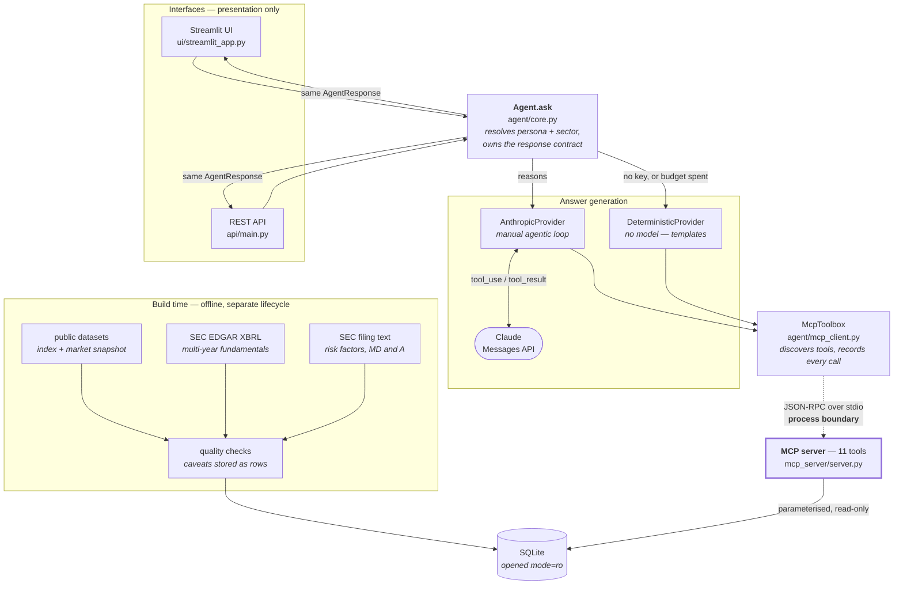
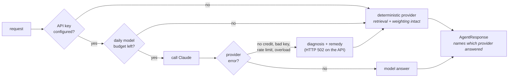
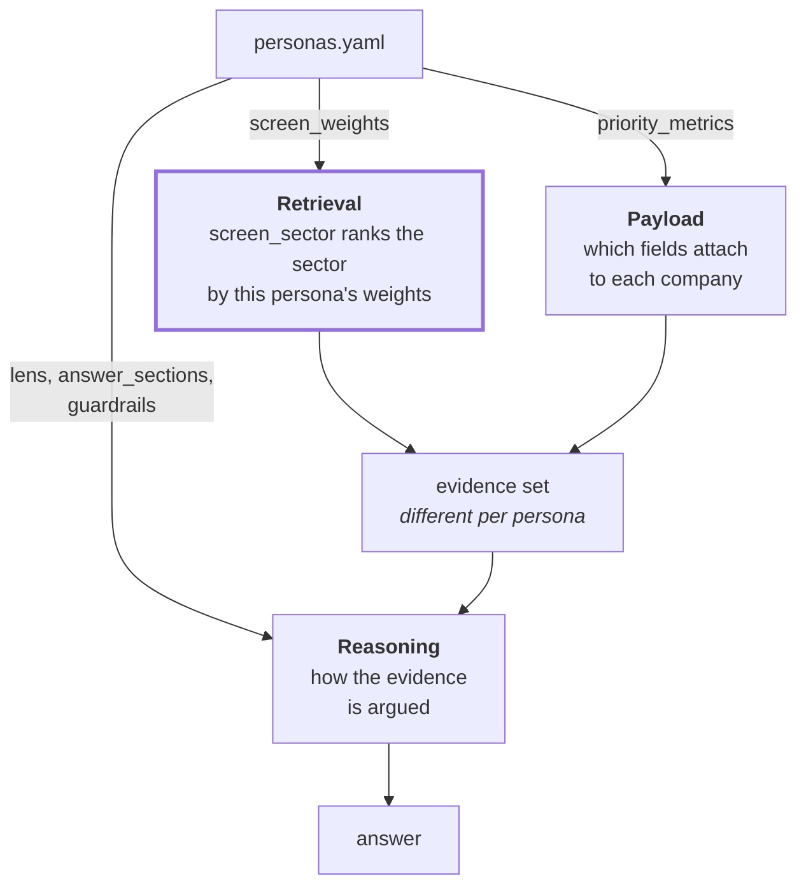

# Architecture

Two views: what the pieces are, and what happens when someone asks a question.

---

## 1. Components

The load-bearing detail is the dashed line. Everything above it is the agent;
everything below is data access, in a separate process, reachable only by
JSON-RPC. The agent has no database handle, no SQL and no schema knowledge —
`grep -rl sqlite3 src/sectorlens/agent/` returns nothing.

**Why it is shaped this way**

| Decision | Consequence |
|---|---|
| Data access behind MCP, in its own process | Swapping SQLite for a warehouse, or moving the server to another host, touches no agent code |
| Both interfaces call one `Agent.ask` | The UI and API cannot drift apart in behaviour, only in presentation |
| Two providers behind one interface | The system runs, and demos, with no API key at all |
| Read-only connection, parameterised statements | No tool argument — including one a model was talked into producing — can write |
| Ingest is a separate lifecycle | The database is a build artifact; the agent never writes |

---

## 2. Request workflow

One question, end to end. The tool loop is the interesting part: the model
never touches data, it asks for it, and every request is recorded by the
harness rather than reported by the model.

```mermaid
sequenceDiagram
    autonumber
    actor User
    participant IF as UI / REST
    participant Agent as Agent.ask
    participant Tools as McpToolbox
    participant MCP as MCP server
    participant DB as SQLite read-only
    participant LLM as Claude

    User->>IF: question + persona + sector
    IF->>Agent: AgentRequest

    Agent->>Tools: open session
    Tools->>MCP: spawn subprocess, list_tools
    MCP-->>Tools: 11 tool schemas
    Note over Tools,MCP: sector and persona are enumerated in<br/>the schema — an invalid value is unrepresentable

    Agent->>LLM: system prompt (persona lens + evidence rules) + tools

    loop until no tool_use, or budget spent
        LLM-->>Agent: tool_use blocks
        Agent->>Tools: call_tool
        Tools->>MCP: JSON-RPC request
        MCP->>DB: parameterised query
        DB-->>MCP: rows
        MCP-->>Tools: result, or an explicit "not held"
        Tools-->>Agent: payload + ok/failed, latency
        Agent->>LLM: tool_result (is_error when the tool reported one)
    end

    Note over Agent,LLM: budget exhausted → one final call with<br/>tool_choice: none, so the turn cannot be spent<br/>on another tool call

    LLM-->>Agent: structured JSON (schema-constrained)
    Agent-->>IF: AgentResponse
    IF-->>User: answer + evidence + caveats + tool trace
```

**What the response carries, and who vouches for it**

| Field | Source | Can the model fabricate it? |
|---|---|---|
| `answer`, `evidence`, `caveats` | the model, constrained by a JSON schema | it is bounded by what the tools returned |
| `companies_referenced`, `out_of_scope` | the model | checked against the database by the eval |
| `tool_calls`, latency, `ok` | **the harness** | **no** — observed, not asserted |
| `provider`, `model`, `elapsed_ms` | **the harness** | **no** |

### Degradation paths

None of these fail the request; each is visible in the response.

---

## 3. Where persona bites

A persona is a YAML block, not a prompt string, and the layer that matters is
the first one — it changes which rows come back, before any model sees them.

Two weights are deliberately inverted, which is why the rankings diverge rather
than merely reorder:

| Metric | Mutual Fund | Private Equity | Why |
|---|---|---|---|
| `market_cap` | high is better | **low is better** | A long-only fund needs liquidity and index-relevant size; a sponsor needs something financeable |
| `ebitda_margin_gap_to_sector` | not weighted | **high is better** | A below-median margin is a quality problem to one lens and operational headroom to the other |
